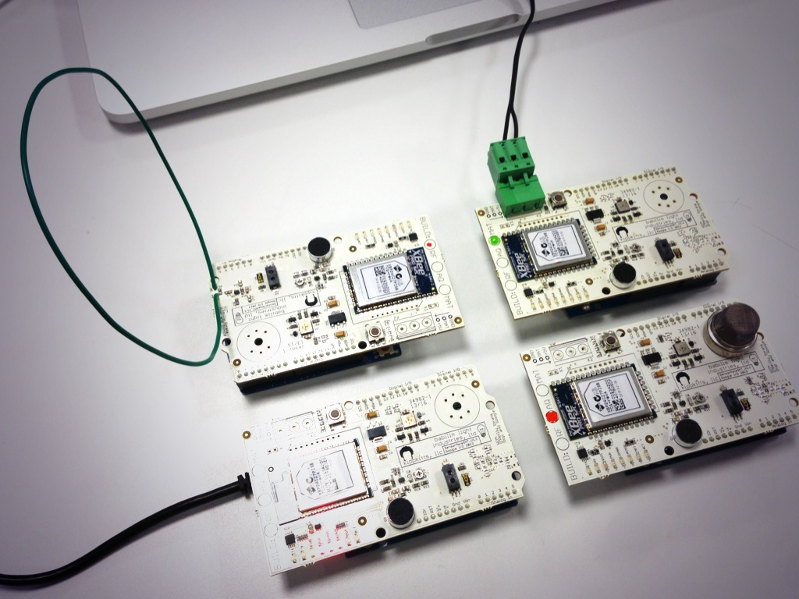
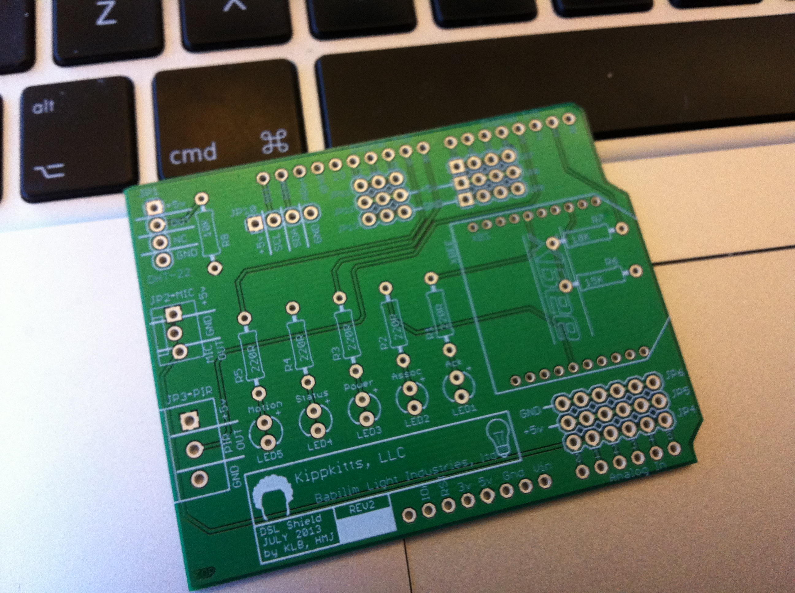
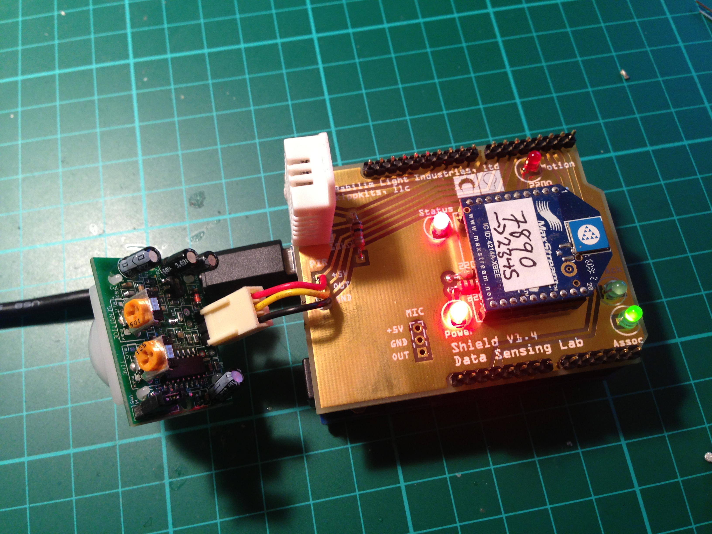
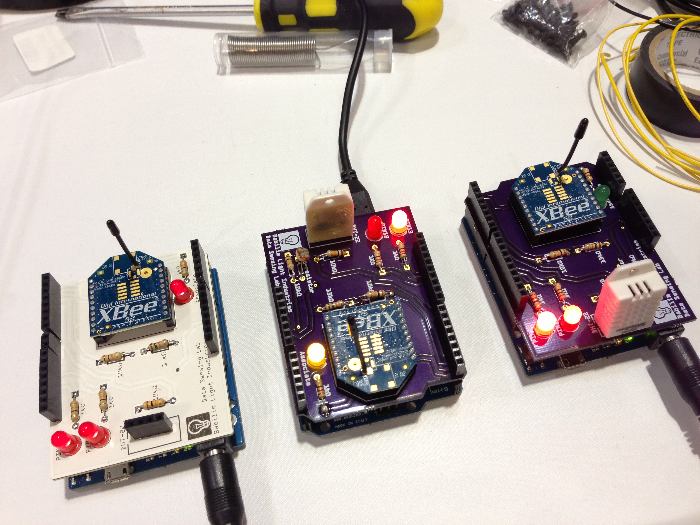
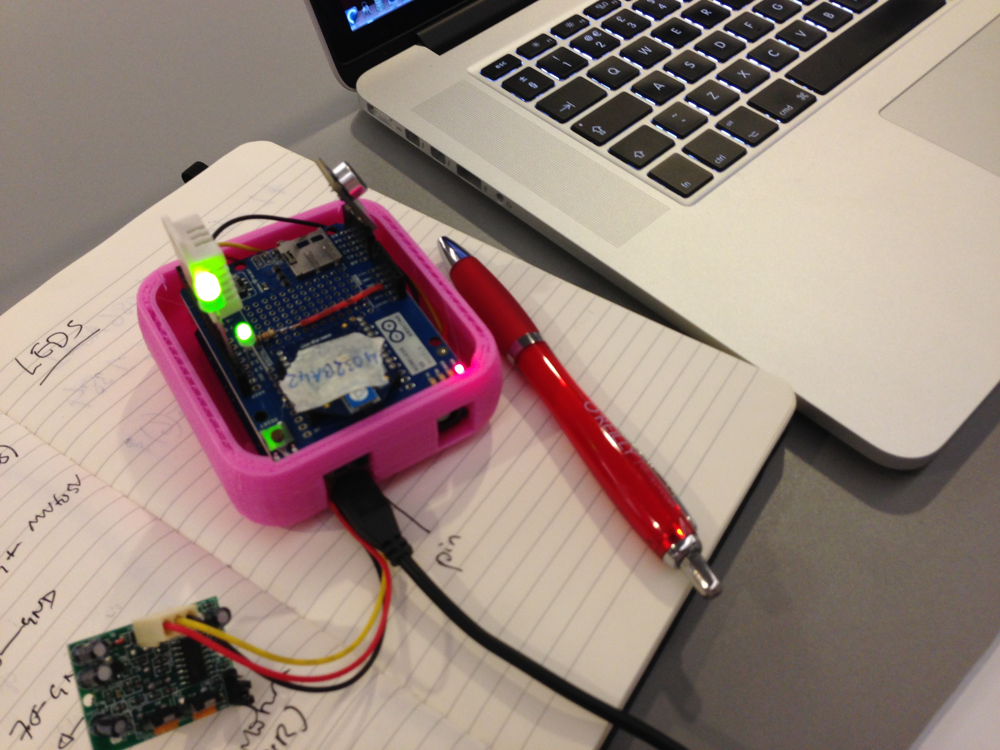
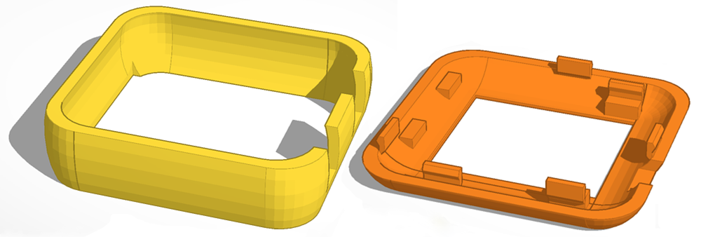

DataSensingLab
==============

This repository contains code and hardware designs for several different boards associated with the [Data Sensing Lab](http://datasensinglab.com) project.

##Google I/O

Here you can find the code and hardware designs for the sensor motes used by the [Data Sensing Lab](http://datasensinglab.com) at Google I/O in 2013. Details of the previous generation of motes, used at the O'Reilly Strata conferences have their [own repository](https://github.com/aallan/SensorMote). You can now [buy these boards](http://datasensinglab.com/dslstore/) at the Lab Store.

##Data Sensing Lab Workshops

The code and hardware designs for the Data Sensing Lab Arduino Shield, used as part of the Workshop kit, and associated with the "[Distributed Network Data](http://www.anrdoezrs.net/click-6760607-11260198?url=http%3A%2F%2Fshop.oreilly.com%2Fproduct%2F0636920028802.do%3Fcmp%3Daf-strata-book-product_cj_9781449360269_%25zp&cjsku=0636920028802)" workshop run by Data Sensing Lab fellows Alasdair Allan and Kipp Bradford.

##Distributed Network Data

The code and hardware designs for the for the shield board associated with the "[Distributed Network Data](http://www.anrdoezrs.net/click-6760607-11260198?url=http%3A%2F%2Fshop.oreilly.com%2Fproduct%2F0636920028802.do%3Fcmp%3Daf-strata-book-product_cj_9781449360269_%25zp&cjsku=0636920028802)" book written by Data Sensing Lab fellows Alasdair Allan and Kipp Bradford.

##Strata CA, 2013

The Sensor Mote from Strata Conference in California in 2013

*Note:* Before you can open the [Fritzing](http://fritzing.org/) (.fzz) file—depending on which version of Fritzing you have—you may need to install the [Adafruit Fritzing Library](https://github.com/adafruit/Fritzing-Library). A full [Bill of Materials](https://docs.google.com/spreadsheet/pub?key=0AugbBYkicsD0dGE2TFZxSi1pV0dEalZ0ZVpvWkNHclE&output=html) is also available.

##Strata New York, 2012

The Sensor Mote from the Strata Conference in New York in 2012.

*Note:* Before you can open the [Fritzing](http://fritzing.org/) (.fzz) file—depending on which version of Fritzing you have—you may need to install the [Adafruit Fritzing Library](https://github.com/adafruit/Fritzing-Library). A full [Bill of Materials](https://docs.google.com/spreadsheet/pub?key=0AugbBYkicsD0dGE2TFZxSi1pV0dEalZ0ZVpvWkNHclE&output=html) is also available.

##Enclosures

To 3D-print your own enclosures for the sensor motes, you can download the STL files designed by Brian Jepson of Maker Media.
